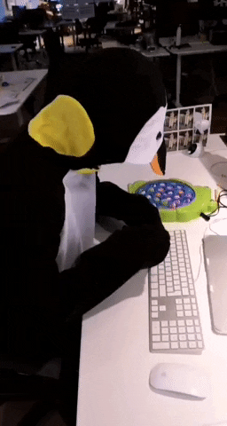

# EasyDeco - Teste para vaga de Frond-End

Quer trabalhar em uma startup de alto crescimento e fazer parte da nossa missão de transformar a vida das pessoas fazendo a casa dos sonhos possível para todos?

Nosso time de desenvolvimento é parte crucial nessa jornada e estamos sempre em busca de pessoas engajadas, motivadas e apaixonadas por tecnologia!

Venha fazer parte desse time e ter contato com tecnologias de ponta, pessoas experientes (gente boa) além de ser desafiado a melhorar e aprender uma coisa nova todos dias.

## Descrição do teste

Você deverá criar um CRUDL (Create/Read/Update/Delete/List) simples de um cadastro de arquiteta com Nome, Telefone, Email, Senha e Foto. 

Não se preocupe com a parte de salvar os dados em um servidor. O intuito desse teste é validar os conhecimentos em front-end e por isso basta que a interface esteja funcionando corretamente, ou seja, no momento que o cliente insere corretamente os dados basta exibir uma mensagem de sucesso no front-end. 

Quanto a listagem, pode-se inserir dados na mão para validar a interface. Não é necessário buscar os dados em nenhum servidor ou API.

**NÃO É PERMITIDO UTILIZAR TEMPLATES PRONTOS. VOCÊ PODERÁ SE "INSPIRAR", MAS SEJA CRIATIVO!**

Lembre-se, iremos avaliar coisas como:

- Estrutura do HTML, CSS
- Código Javascript
- Documentação do código
- Usabilidade
- Identidade visual

Esperamos códigos em HTML, CSS e Javascript. Se quiser utilizar algum framework ou ferramenta, sem problemas! Só lembre de nos dizer como fazer para rodar sua aplicação!

Nice to have:

- Layout Responsivo (Desktop e mobile layouts)
- Animações em CSS/Javascript

## Prazo

**VOCÊ TEM 5 DIAS A PARTIR DO RECEBIMENTO DO TESTE PARA NOS ENVIAR O CÓDIGO :)** 

### BOA SORTE!
